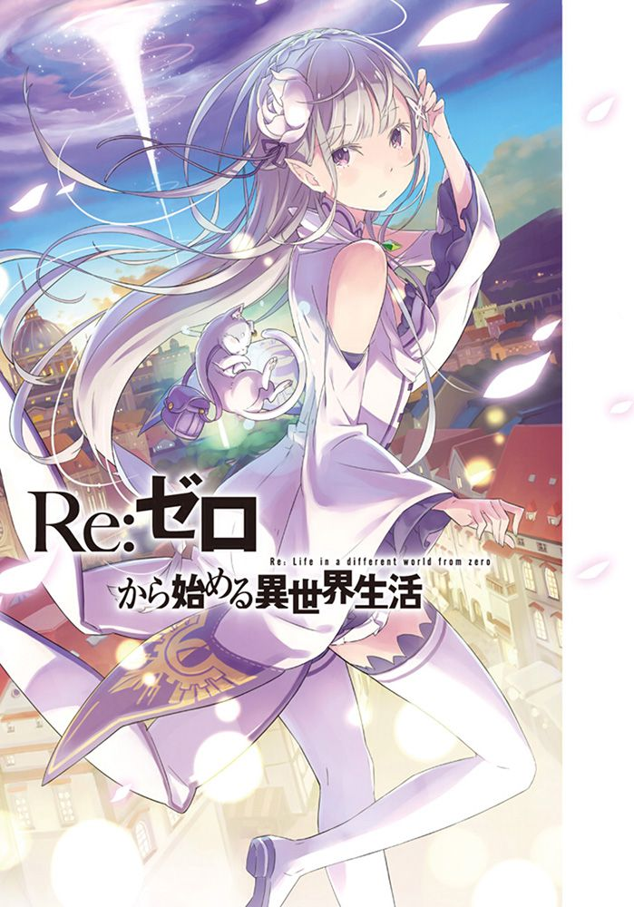

## 第一章　『怒涛般的第一天』

- [序章　『开始的余温』](00.md)
- [01　『无法使用的十元硬币』](01.md)
- [02　『不要得意忘形，神明如是说』](02.md)
- [03　『第一次见识到魔法』](03.md)
- [04　『膝枕的报恩』](04.md)
- [05　『你的名字是？』](05.md)
- [06　『第一次的终结』](06.md)
- [07　『无法理解的再会』](07.md)
- [08　『苦酒的味道』](08.md)
- [09　『王牌的打法』](09.md)
- [10　『失言的代价』](10.md)
- [11　『迟来的抵抗』](11.md)
- [12　『再会的魔女』](12.md)
- [13　『终结与开始』](13.md)
- [14　『事不过四』](14.md)
- [15　『被称为『剑圣』的男人』](15.md)
- [16　『贫民窟中的交涉』](16.md)
- [17　『赃物库中的交涉』](17.md)
- [18　『赃物库的攻防战』](18.md)
- [19　『精灵术师的战斗』](19.md)
- [20　『登场角色凑齐了』](20.md)
- [21　『剑圣的威力』](21.md)
- [22　『从零开始的异世界生活』](22.md)
- [幕間　『月亮高挂夜空』](23.md)
- [后记　『篇章插图』](99.md)

