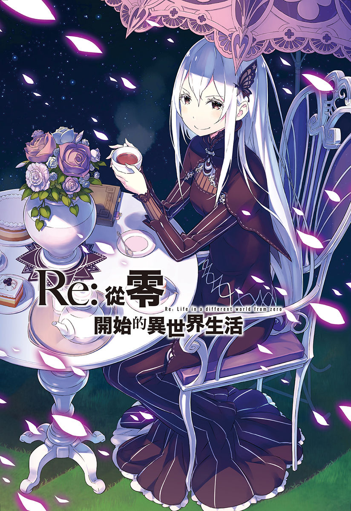
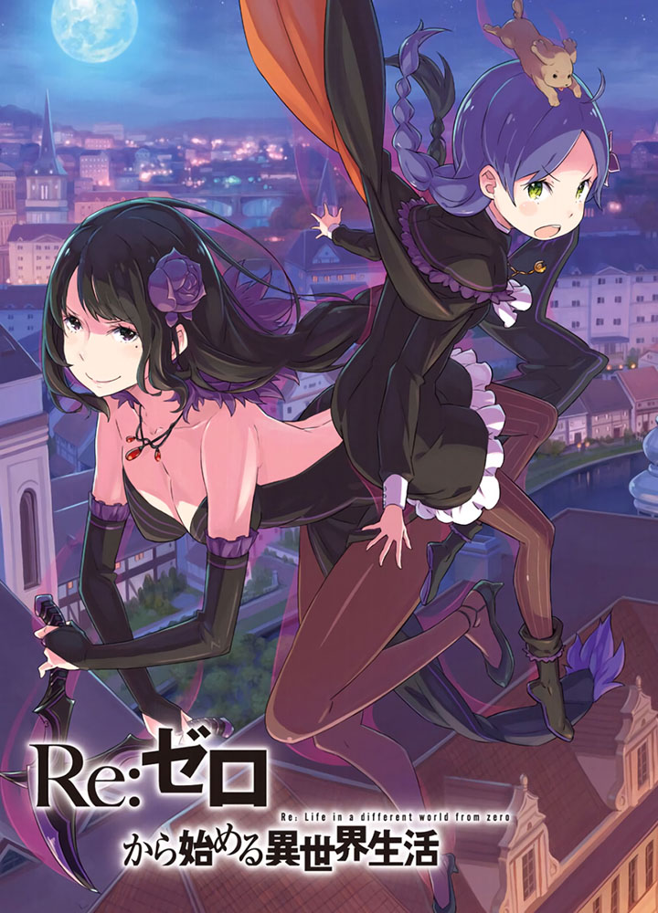
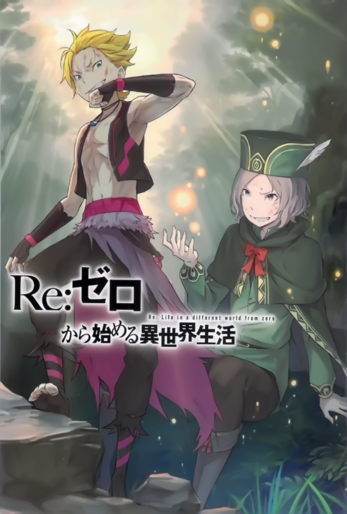
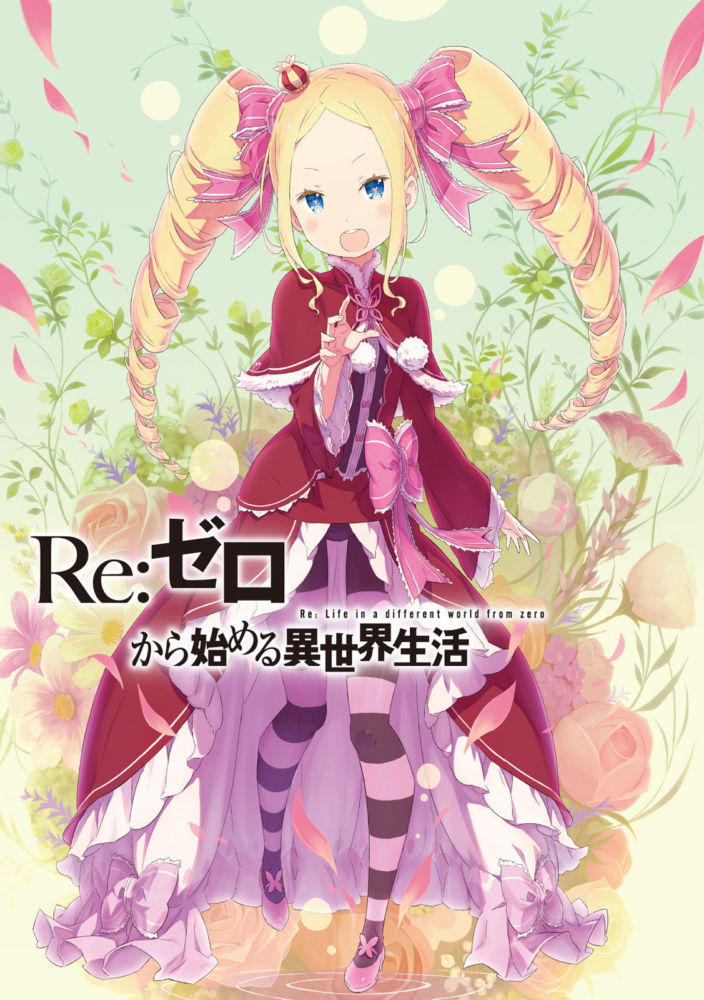

## 第四章　『永远的契约』（圣域篇）

- [序章　『坟墓』](00.md)
- [01　『可以回去的地方』](01.md)
- [02　『咒骂与感谢』](02.md)
- [03　『与重逢擦肩而过』](03.md)
- [04　『下一个地方』](04.md)
- [05　『艾米莉娅阵营』](05.md)
- [06　『去圣域的路上』](06.md)
- [07　『实验场』](07.md)
- [08　『等待已久的再会』](08.md)
- [09　『墓所』](09.md)
- [10　『求知欲的化身』](10.md)
- [11　『傲慢x怠惰x憤怒』](11.md)
- [12　『茶会礼物』](12.md)
- [13　『罗兹瓦尔的思念』](13.md)
- [14　『回答疑问』](14.md)
- [15　『资格与试炼』](15.md)
- [16　『菜月家的早晨』](16.md)
- [17　『恋爱话题』](17.md)
- [18　『父子』](18.md)
- [19　『作业』](19.md)
- [20　『试炼結果』](20.md)
- [21　『重新下定决心』](21.md)
- [22　『软弱』](22.md)
- [23　『迈出的一步』](23.md)
- [24　『等待』](24.md)
- [25　『冰之森』](25.md)
- [26　『停滞不前』](26.md)
- [27　『低语』](27.md)
- [28　『茶会对话』](28.md)
- [29　『杂食系男子』](29.md)
- [30　『归途中的违和感』](30.md)
- [31　『妹抖・妹抖・妹抖』](31.md)
- [32　『1/4』](32.md)
- [33　『风吹的密道』](33.md)
- [34　『终结的世界』](34.md)
- [35　『少女的福音』](35.md)
- [36　『在无法理解的尽头』](36.md)
- [37　『首次摸索』](37.md)
- [38　『芋虫』](38.md)
- [39　『友人』](39.md)
- [40　『協力者』](40.md)
- [41　『虎』](41.md)
- [42　『生命的价值』](42.md)
- [43　『然后谁也——』](43.md)
- [44　『禁忌』](44.md)
- [45　『茶会的条件』](45.md)
- [46　『蝗害』](46.md)
- [47　『相性不好的对手』](47.md)
- [48　『茶会的代价』](48.md)
- [49　『LOVELOVELOVELOVELOVELOVEYOUー』](49.md)
- [50　『远处处的吼声』](50.md)
- [51　『LOVELOVELOVE……LOVELOVELOVEME–』](51.md)
- [52　『细微的变化』](52.md)
- [53　『重叠的疑问』](53.md)
- [54　『地狱什么的我早已知晓』](54.md)
- [55　『水晶中的少女』](55.md)
- [56　『圣域的存在理由』](56.md)
- [57　『不老不死的实验』](57.md)
- [58　『婆婆』](58.md)
- [59　『甜蜜的烤点心与并不甜蜜的话语』](59.md)
- [60　『结束终焉的话语』](60.md)
- [61　『跨越四百年的悲鸣』](61.md)
- [62　『罗兹瓦尔宅邸的惨剧』](62.md)
- [63　『死之共感』](63.md)
- [64　『支离破碎的世界』](64.md)
- [65　『雪中的热情』](65.md)
- [66　『赤色的雪景』](66.md)
- [67　『魔人』](67.md)
- [68　『死的味道』](68.md)
- [69　『骗子』](69.md)
- [70　『地狱的更深处』](70.md)
- [71　『Ending List』](71.md)
- [幕間　『茶会』](131.md)
- [72　『BAD END 1、5、11』](72.md)
- [73　『软弱的所在之处』](73.md)
- [74　『魔女的企图与提案』](74.md)
- [75　『那个人』](75.md)
- [76　『≠莎缇拉』](76.md)
- [77　『孤身一人的……』](77.md)
- [78　『欲哭的声音』](78.md)
- [79　『梦的终结』](79.md)
- [幕間　『宾客散去』](132.md)
- [80　『粗糙的舌头』](80.md)
- [81　『光明』](81.md)
- [82　『尔虞我诈』](82.md)
- [83　『相互坦白』](83.md)
- [84　『否定×否定×否定』](84.md)
- [85　『用话语、用心意、用拳头』](85.md)
- [86　『毫无胜算』](86.md)
- [87　『鬼在外，两个小丑在内』](87.md)
- [88　『加菲尔的思绪』](88.md)
- [89　『雪之记忆』](89.md)
- [90　『——对不起』](90.md)
- [91　『虚假的长眠』](91.md)
- [92　『谎言』](92.md)
- [93　『相互的提案』](93.md)
- [94　『遗弃』](94.md)
- [95　『西格玛（∑）』](95.md)
- [96　『双唇红染』](96.md)
- [97　『黎明之前』](97.md)
- [98　『余温渐消的床铺』](98.md)
- [99　『封闭之所，孤身一人』](99.md)
- [100　『埋藏于尘埃中的回忆』](100.md)
- [101　『θ其一』](101.md)
- [102　『记忆中没有的回忆』](102.md)
- [103　『圣域的起始与崩坏的开端』](103.md)
- [104　『θ其二』](104.md)
- [105　『旅行商人的陷阱』](105.md)
- [106　『奥托・苏文』](106.md)
- [107　『最后的陷阱』](107.md)
- [108　『只有时机好的男人』](108.md)
- [109　『错误的选择』](109.md)
- [110　『相信的理由』](110.md)
- [111　『加菲尔的结界』](111.md)
- [112　『拒绝软弱的本能』](112.md)
- [113　『奎因之石靠一个人是没法搬动的』](113.md)
- [114　『将谎言化为祈愿』](114.md)
- [115　『青梅竹马的女人面前抬不起头』](115.md)
- [116　『祖母、母亲、姐姐、孙子、儿子、弟弟』](116.md)
- [117　『情信』](117.md)
- [118　『平家星笑的日子』](118.md)
- [119　『现在也，过去也，不变的爱』](119.md)
- [120　『艾力欧尔大森林的永久冻土』](120.md)
- [121　『请帮帮他』](121.md)
- [122　『咆哮的再会』](122.md)
- [123-A　『猎肠者VS圣域之盾』](123-A.md)
- [123-B　『反映在水面上的幸福』](123-B.md)
- [124-A　『给我听好，笨蛋』](124-A.md)
- [125-A　『罗兹瓦尔宅邸攻防战』](125-A.md)
- [126-A　『漆黑森林之王，基尔提拉乌的袭击！』](126-A.md)
- [127-A　『罗兹瓦尔府的最后一日』](127-A.md)
- [128　『最喜欢血肉和内脏』](128.md)
- [129　『――选择我』](129.md)
- [124-B　『映于镜中的你』](124-B.md)
- [125-B　『从复仇开始』](125-B.md)
- [126-B　『下次一定要开茶会』](126-B.md)
- [127-B　『已经够了什么的』](127-B.md)
- [130　『雪的颜貌』](130.md)
- [幕間　『各自的妥协』](133.md)
- [幕間　『艾米莉娅阵营・魔人・精灵・精灵使』](134.md)
- [蛇足　『再临』](135.md)
- [后记　『篇章插图』](199.md)

|  |  |  |
|:------:|:------:|:------:|
|  |  |  |

