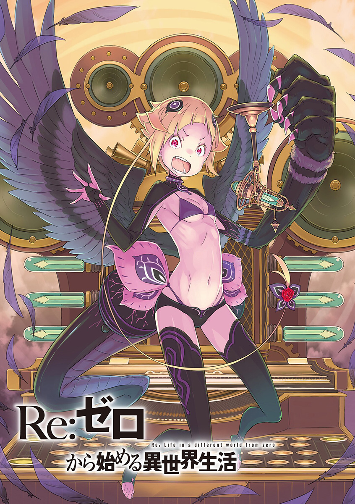
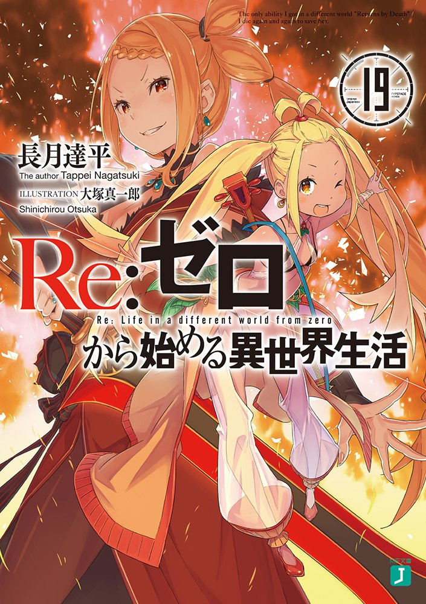
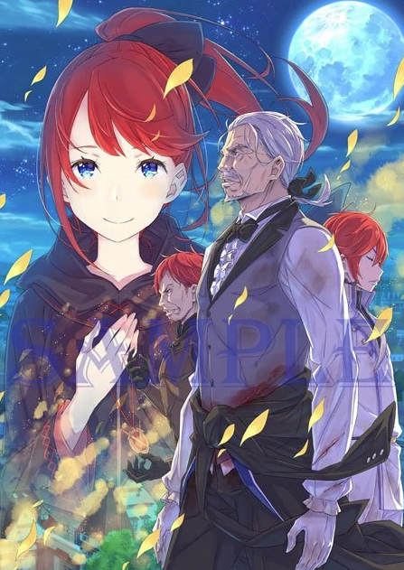

## 第五章　『刻画历史的群星』

- [01　『事情的起头总是由到访者开始』](01.md)
- [02　『虚伪的血统』](02.md)
- [03　『各自的见解』](03.md)
- [04　『旅行途中』](04.md)
- [05　『水门都市』](05.md)
- [06　『两位精灵骑士，强欲商人和无欲天使』](06.md)
- [07　『向那罪孽深重的男人起航』](07.md)
- [08　『晕船的同伴』](08.md)
- [09　『歌姬的价值』](09.md)
- [10　『水之都市的归途』](10.md)
- [11　『意外的再会，本该到来的再会，意想不到的再会』](11.md)
- [12　『拜垫客厅里非常的气氛』](12.md)
- [13　『祥和的晚餐』](13.md)
- [14　『月下的剑鬼』](14.md)
- [15　『吵闹的寂静』](15.md)
- [16　『不速之客』](16.md)
- [17　『穿惯了的铠甲』](17.md)
- [18　『歌舞的间歇之时』](18.md)
- [19　『剧场型恶意』](19.md)
- [20　『共相高涨的情绪』](20.md)
- [21　『最佳的解法』](21.md)
- [22　『草率的解法』](22.md)
- [23　『被扰乱的事态』](23.md)
- [24　『冰炎的结局』](24.md)
- [25　『狮子座剧场』](25.md)
- [26　『爱的矛头』](26.md)
- [27　『噪音』](27.md)
- [28　『满身疮痍的作战会议』](28.md)
- [29　『华丽之虎』](29.md)
- [30　『月下的虎与猫』](30.md)
- [31　『犯错的代价』](31.md)
- [32　『都市厅舍攻略会议』](32.md)
- [33　『都市厅舍攻略战』](33.md)
- [34　『剑斗与乱战』](34.md)
- [35　『埋伏与奇袭』](35.md)
- [36　『爱的起点与终点』](36.md)
- [37　『重整旗鼓』](37.md)
- [38　『魔女教的要求』](38.md)
- [39　『骑士作风与迟来的男子』](39.md)
- [40　『愤怒的侵蚀』](40.md)
- [41　『英雄幻想』](41.md)
- [42　『最为新生的英雄与最为古老的英雄』](42.md)
- [43　『汇合前的情况』](43.md)
- [44　『开诚布公吧』](44.md)
- [45　『无法逃离的束缚』](45.md)
- [46　『心境』](46.md)
- [47　『都市夺还攻略前哨』](47.md)
- [48　『真正喜欢的人』](48.md)
- [49　『强欲攻略战开幕』](49.md)
- [50　『爱之枷锁』](50.md)
- [51　『愚弄着的恶意』](51.md)
- [52　『星与大罪司教』](52.md)
- [53　『混战都市』](53.md)
- [54　『非战斗人员的战斗力』](54.md)
- [55　『斗神的挑战者』](55.md)
- [56　『签署断绝关系声明』](56.md)
- [57　『心脏的所在』](57.md)
- [58　『——我相信』](58.md)
- [59　『雷格鲁斯・柯尼亚斯』](59.md)
- [60　『一波方平，一波又起』](60.md)
- [61　『领域的被害者』](61.md)
- [62　『战士的称赞』](62.md)
- [63　『莉莉安娜・马斯可芮德的情热』](63.md)
- [64　『莉莉安娜・马斯可芮德的忧郁』](64.md)
- [65　『莉莉安娜・马斯可芮德的后悔』](65.md)
- [66　『莉莉安娜・马斯可芮德的舞台』](66.md)
- [67　『莉莉安娜・马斯可芮德』](67.md)
- [68　『吞食名字的美食家』](68.md)
- [69　『丑恶的晚餐会』](69.md)
- [70　『喰』](70.md)
- [71　『剑鬼VS先代剑圣』](71.md)
- [72　『剑圣VS前代剑圣』](72.md)
- [73　『特蕾西亚・范・阿斯特雷亚』](73.md)
- [74　『普利斯提拉保卫战战果1』](74.md)
- [75　『普利斯提拉保卫战战果2』](75.md)
- [76　『普利斯提拉攻防战成果3』](76.md)
- [77　『无名的骑士』](77.md)
- [78　『水门都市的余波』](78.md)
- [79　『贤者的监视塔』](79.md)
- [80　『水面上留下波纹』](80.md)
- [81　『充满贪婪的那些人』](81.md)
- [幕間　『结对的条件』](82.md)
- [幕間　『未完成的大器』](83.md)
- [幕間　『温暖的名字』](84.md)
- [后记　『篇章插图』](99.md)

|  |  |  |
|:------:|:------:|:------:|
| 　 | 　 | 　 |

|  |  |
|:------:|:------:|
| 　 | 　 |

