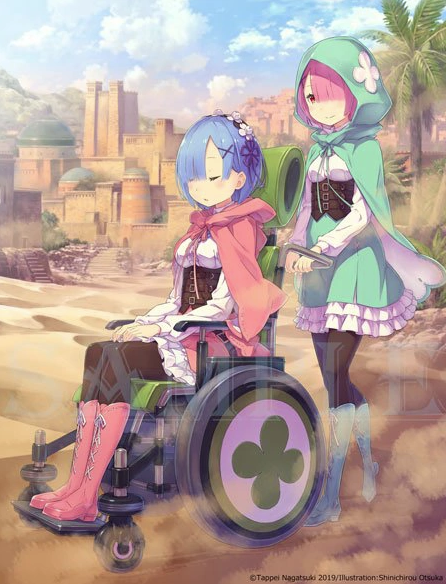

## 第六章　『记忆的回廊』

- [序章　『贤者监视塔』](00.md)
- [01　『龙车归途路』](01.md)
- [02　『他相应的款待』](02.md)
- [03　『少女的牢笼』](03.md)
- [04　『把你带出的理由』](04.md)
- [05　『各自的不安』](05.md)
- [06　『尤里乌斯的身世』](06.md)
- [07　『以沙海为目标』](07.md)
- [08　『沙丘的洗礼』](08.md)
- [09　『沙时间中的跋涉』](09.md)
- [10　『宛如闪光』](10.md)
- [11　『听见眼泪的声音』](11.md)
- [12　『监视塔的洗礼』](12.md)
- [13　『沙海的嘲笑』](13.md)
- [14　『沙海之上的信赖』](14.md)
- [15　『沙子上凋零着』](15.md)
- [16　『咀嚼的味道』](16.md)
- [17　『沙海之王』](17.md)
- [18　『砂塔的看守者』](18.md)
- [19　『贤者的行踪』](19.md)
- [20　『夏乌拉≠贤者=弗琉盖尔』](20.md)
- [21　『巨石板的挑战书』](21.md)
- [22　『白色星空的群星』](22.md)
- [23　『三层塔吉忒大图书馆』](23.md)
- [24　『性格扭曲的考官』](24.md)
- [25　『二层厄勒克特拉盼望之人』](25.md)
- [26　『挥棒的男人』](26.md)
- [27　『厄勒克特拉的高墙』](27.md)
- [28　『尤里乌斯・尤克历乌斯』](28.md)
- [29　『失败者』](29.md)
- [30　『二层攻略反省会』](30.md)
- [31　『塔内的共同生活』](31.md)
- [32　『何者』](32.md)
- [33　『■■■・■■■』](33.md)
- [34　『出了便利店后，那是一个不可思议的世界』](34.md)
- [35　『如履薄冰的关系』](35.md)
- [36　『安心感的安置处』](36.md)
- [37　『纸老虎所见之梦』](37.md)
- [38　『NISHISHEI』](38.md)
- [39　『残骸』](39.md)
- [40　『被星空抛弃』](40.md)
- [41　『安心的臭味』](41.md)
- [42　『死者们的塔』](42.md)
- [43　『生者们的塔』](43.md)
- [44　『血之勋章』](44.md)
- [45　『罪人的拥抱』](45.md)
- [46　『梅莉・波特鲁特』](46.md)
- [47　『我不会原谅你』](47.md)
- [48　『——杀人，会成为习惯』](48.md)
- [49　『致给废柴的你』](49.md)
- [50　『——正因废柴才恰恰是你』](50.md)
- [51　『生者们的塔 PART2』](51.md)
- [52　『神啊，请宽恕我吧』](52.md)
- [53　『——传来了、声音』](53.md)
- [54　『Re：从零开始的异世界生活』](54.md)
- [55　『等待雪融的你』](55.md)
- [56　『今后之事』](56.md)
- [57　『暂且放下吧』](57.md)
- [58　『彼归彼，此归此』](58.md)
- [59　『在白色的世界里被嘲笑』](59.md)
- [60　『一人份的陽光』](60.md)
- [61　『——给我站起来』](61.md)
- [62　『崩坏的地响』](62.md)
- [63　『五重障碍』](63.md)
- [64　『第二个障碍』](64.md)
- [65　『第二个、第五个、然后——』](65.md)
- [66　『迈向终焉的第二次机会』](66.md)
- [67　『小小的王』](67.md)
- [68　『天蝎座的女子』](68.md)
- [69　『蛮不讲理的剑之铁锤』](69.md)
- [70　『专情的星星』](70.md)
- [71　『Count・One』](71.md)
- [72　『■■・■』](72.md)
- [73　『 『ナツキ・スバル』 』](73.md)
- [74　『ナツキ・スバル』](74.md)
- [75　『路伊・阿尔尼普』](75.md)
- [76　『名为自己的地狱』](76.md)
- [77　『反击的狼烟』](77.md)
- [78　『四角』](78.md)
- [79　『READY STEADY GO』](79.md)
- [80　『精神之死』](80.md)
- [81　『――我第一次遇见你』](81.md)
- [82　『带枷锁的战斗』](82.md)
- [83　『拉姆』](83.md)
- [84　『嘿咻！　哎呀！』](84.md)
- [85　『GOOD LOSER』](85.md)
- [86　『昨日之谈』](86.md)
- [87　『遥远的目光』](87.md)
- [88　『――询志』](88.md)
- [89　『夏乌拉』](89.md)
- [90　『英雄』](90.md)
- [后记　『篇章插图』](99.md)

